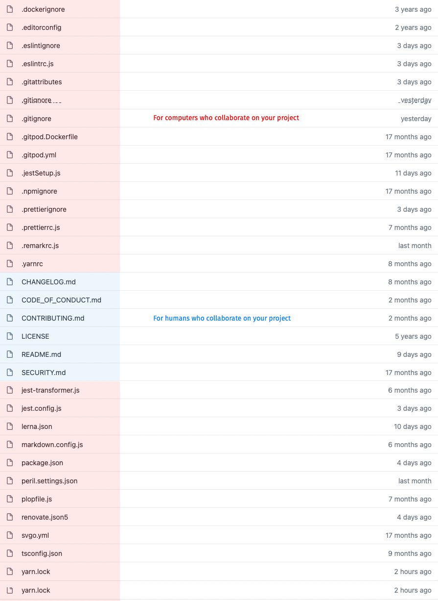

# Humans vs Robots

A chrome extension to highlight files for humans and files for robots in any Github repository. Based on [a blogpost by Jim Nielsen](https://blog.jim-nielsen.com/2021/codbase-collaboration-between-humans-and-robots/)

## Installation

Clone the repository and [install as an "unpacked extension"](https://webkul.com/blog/how-to-install-the-unpacked-extension-in-chrome/)
